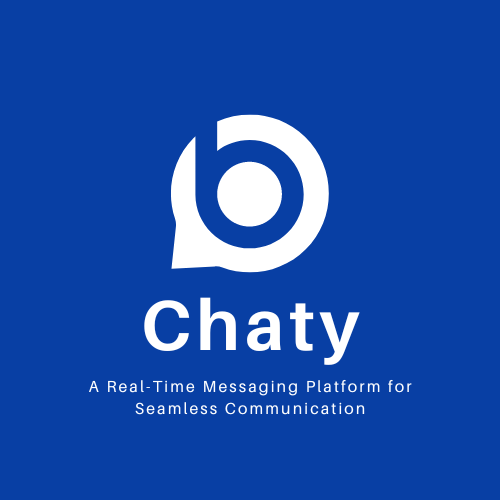

# Chaty: A Real-Time Messaging App

## Table of Contents

- [Overview](#overview)
- [Features](#features)
- [Technologies Used](#technologies-used)
- [Usage](#usage)
- [Contact](#contact)

## Overview

Chaty is a real-time messaging application based on MERN stack technology. Provides secure user authentication, real-time communication through Socket.IO and a responsive, user-friendly interface.Users are able to send and receive messages with notification ringtone in real-time and view active users. The app uses Daisy UI's modern design elements, backed by global state management with Zustand.

## Features

- **Real-Time Messaging**: Instant message delivery with Socket.IO.
- **User Authentication**: Secure sign-up and login with JSON Web Token (JWT).
- **Global State Management**: Zustand for managing application state.
- **Responsive Design**: Styled using Daisy UI for a sleek, responsive UI.
- **Protected Routes**: User-specific content access via React Router.
- **Encrypted Passwords**: User passwords are hashed with Bcrypt.

## Technologies Used

- **Frontend**:

  - React.js
  - React Router for navigation
  - Zustand for global state management
  - Daisy UI for design and styling
  - Axios for API communication

- **Backend**:
  - Node.js and Express.js
  - Socket.IO for real-time messaging
  - Mongoose for MongoDB database integration
  - Bcrypt for password hashing
  - JSON Web Token (JWT) for authentication

## Usage

- **Authentication**: Users can register, log in, and manage their accounts securely using JWT-based authentication.
- **Real-Time Messaging**: Users can send and receive messages instantly in real-time using Socket.IO.
- **Global State Management**: Zustand is used to manage the chat state, including active conversations and message history.
- **Responsive UI**: The app is fully responsive and designed with Daisy UI to ensure a smooth experience across devices.

## Contact

For any questions or feedback, feel free to reach out:

- Email: [muhammadkaif1193@gmail.com](mailto:muhammadkaif1193@gmail.com)
- LinkedIn: [Muhammad Kaif](https://www.linkedin.com/in/muhammad-kaif-059a53261)

